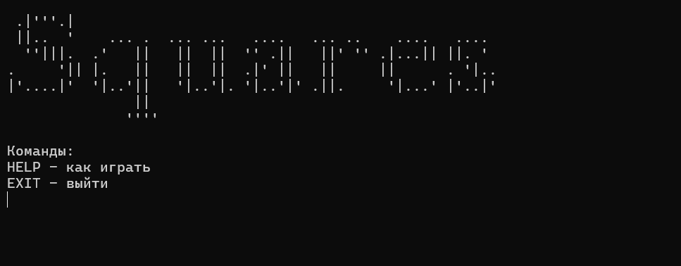
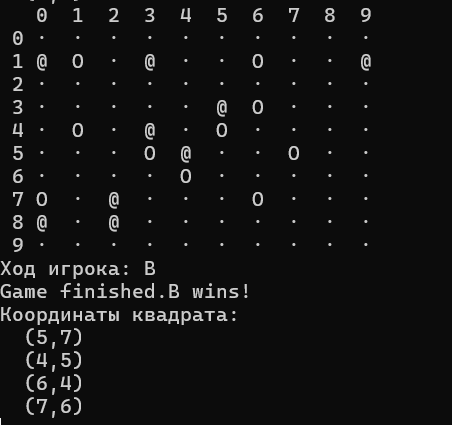

# Задание 1: консольное приложение

Приложение отображает игровое поле, выполнение ходов и результат игры.

Стек технологий: Java-core 17.

### Сборка и запуск
Для запуска, находясь в директории task-1, выполнить:
```
cd game-engine
gradlew build
java -jar build/libs/game-engine-1.0-SNAPSHOT.jar
```
#### Запущенный проект


