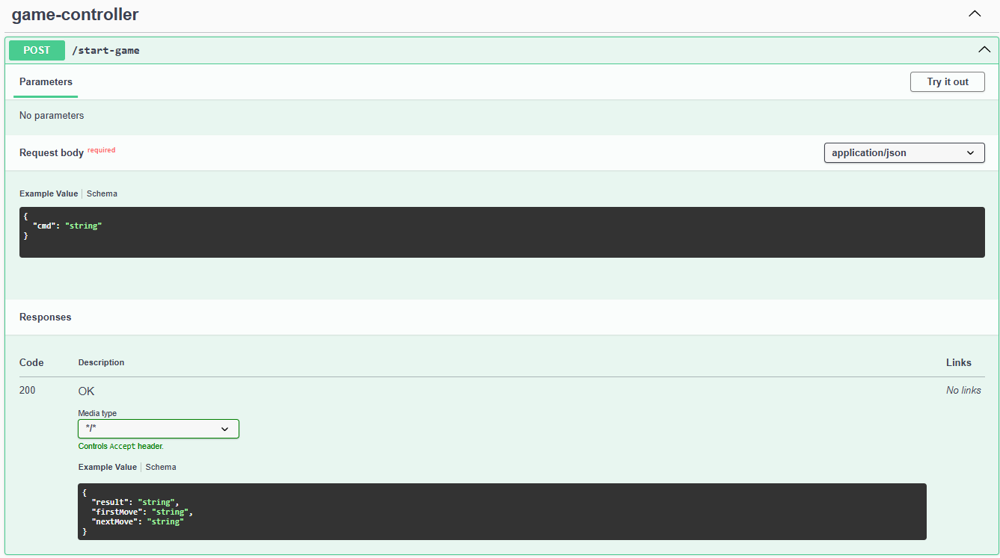
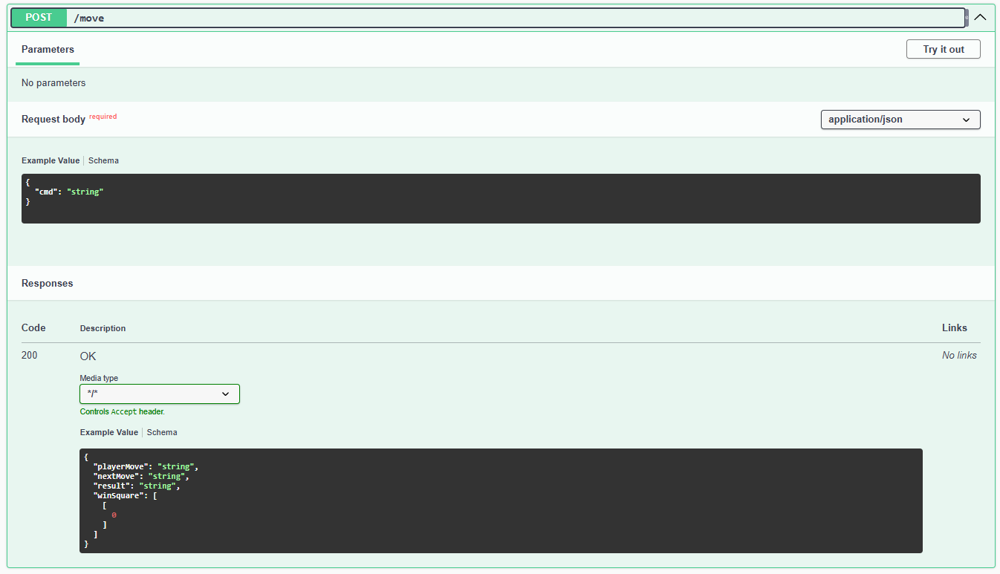

# Задание 2: Web-сервис

Создан API, который принимает команды из предыдущего задания (GAME,MOVE).
Возвращает результат в виде json.

`/game-start`

Если при создании игры, указан первым игроком COMP, то будет выполнен ход и отображен в ответе на запрос (поле `fisrtMove`)

Если при оба игрока - COMP, то ход второго игрока рассчитан и отображен в поле `nextMove`, этот ход будет использован для выполнения `/move` за второго игрока

`/move`

Принимает ход, возвращает:
- следующий ход оппонента `nextMove`, 
- результат 'result', если игра закончилась,
- координаты "выигрышного" квадрата `winSquare`.


Стек технологий: Java-core 17, Spring Framework.

### Сборка и запуск
Для запуска, находясь в директории task-2, выполнить:
```
cd api_game
gradlew bootJar
java -jar resource-server/build/libs/resource-server-0.0.1-SNAPSHOT.jar
```
При запуске запуститься Swagger, также можно открыть перейдя по
`http://localhost:8281/swagger-ui/index.html`

#### Запущенный проект


