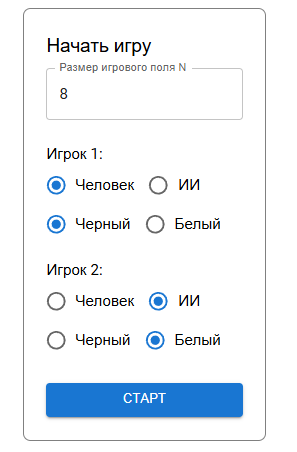
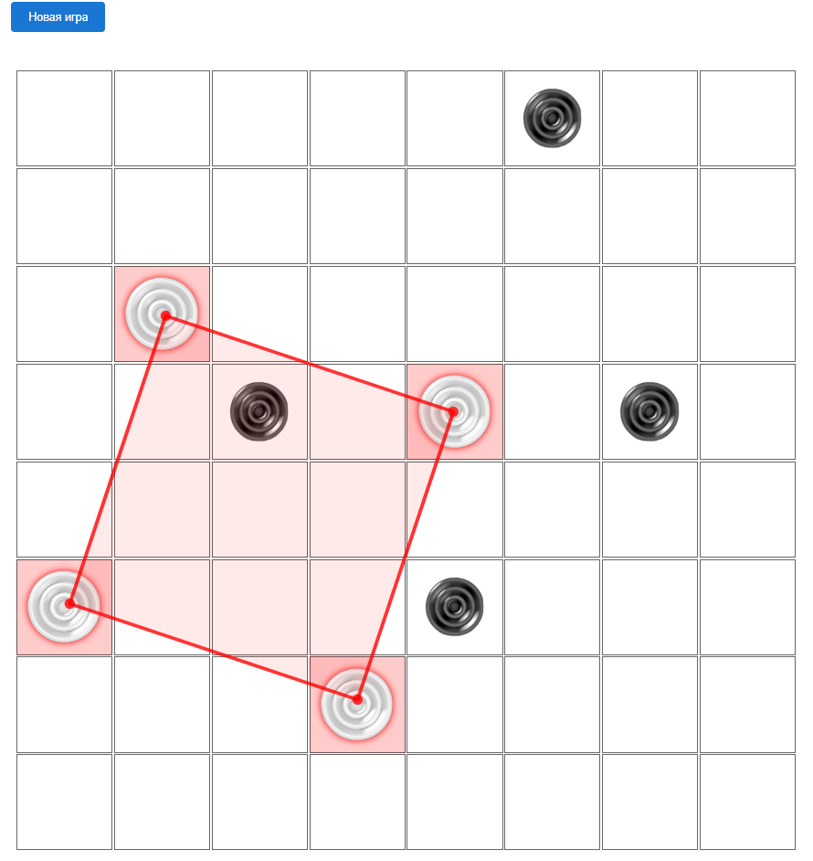

# Задание 3: Web-интерфейс

Web-интерфейс игры (форма для старта игры, игровое поле, отображение результата, справка), который использует API из Web-сервиса прошлого задания.

Стек технологий: Java-core 17, Spring Framework, JavaScript, React.

### Сборка и запуск

Для запуска **Backend**-части, находясь в директории task-3, выполнить:
```
cd backend
gradlew bootJar
java -jar resource-server/build/libs/resource-server-0.0.1-SNAPSHOT.jar
```
При запуске откроется Swagger, также можно открыть перейдя по
`http://localhost:8281/swagger-ui/index.html`


Для запуска **Frontend**-части, находясь в директории task-3, выполнить:
```
cd frontend
npm install
npm start
```
При запуске откроется React-приложение, также можно открыть перейдя по
`http://localhost:3000/`


#### Запущенный проект


